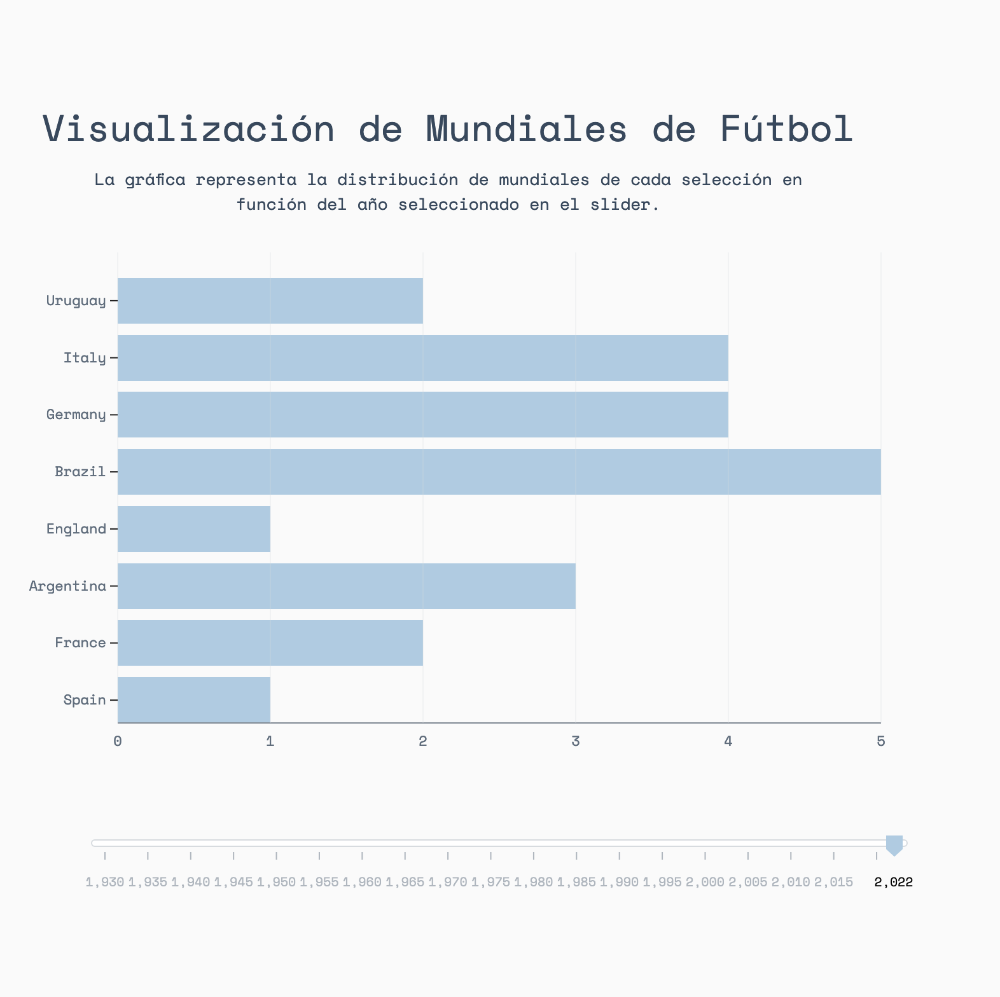
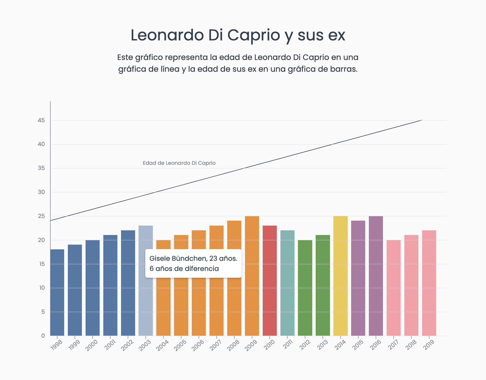
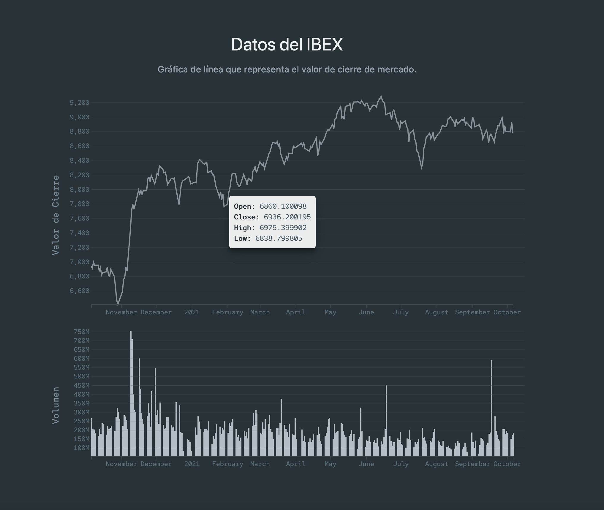

# D3.js – Ejemplos Interactivos de Visualización de Datos

Este proyecto es una colección de visualizaciones desarrolladas con la biblioteca **[D3.js](https://d3js.org/)**, diseñadas para explorar distintos enfoques de representación de datos con interactividad, escalabilidad y claridad visual.

Cada ejemplo se encuentra en una carpeta independiente y puede ejecutarse de forma local desde un navegador. Se ha utilizado la librería **[Materialize CSS](https://materializecss.com/)** para mejorar la presentación visual.

## Contenido del Proyecto

### Ejemplo 1 - Gráfica de Barras Horizontales: Mundiales de Fútbol

**Objetivo:** Visualizar cuántas veces ha ganado cada selección nacional la Copa del Mundo.

**Descripción:**

- Gráfica de barras horizontales ordenadas por número de títulos.
- Un control deslizante permite seleccionar un año específico y actualizar la visualización dinámicamente.
- Uso de animaciones y escalas para transición fluida.

**Carpeta:** [`example-1/`](example-1/)



### Ejemplo 2 - Gráfica combinada: Edad de Leonardo DiCaprio y sus ex parejas

**Objetivo:** Comparar la edad de Leonardo DiCaprio y la de sus ex parejas en distintos años.

**Descripción:**

- Línea de tiempo con la edad de DiCaprio.
- Barras que representan la edad de cada ex pareja en el mismo año.
- Tooltip interactivo con información de cada relación y diferencia de edad.
- Colores únicos asignados a cada pareja.

**Carpeta:** [`example-2/`](example-2/)



### Ejemplo 3: - Gráfica del IBEX 📉

**Objetivo:** Representar el comportamiento del mercado en el IBEX 35 a través de dos métricas clave.

**Descripción:**

- Gráfica de líneas para mostrar el valor de cierre del índice bursátil.
- Gráfica de barras con volumen de mercado bajo la misma escala de tiempo.
- Ideal para análisis temporal y financiero básico.

**Carpeta:** [`example-3/`](example-3/)



## Cómo usar este repositorio

1. Clona el proyecto:

   ```bash
   git clone https://github.com/your-username/d3js-examples.git
   ```

2. Navega a la carpeta del ejemplo que deseas visualizar y ejecuta el archivo `index.html` en tu navegador:

   ```bash
   cd d3js-examples/example-1
   ```

3. Asegúrate de tener los permisos necesarios si abres archivos locales (Chrome puede bloquearlo sin un servidor local).
